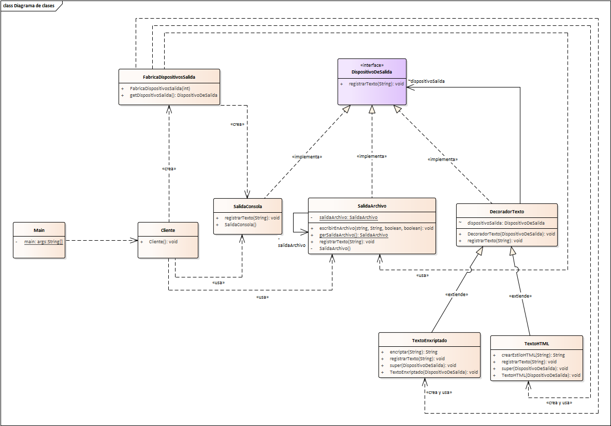

# Ejercicio Patrones de Diseño

## Datos Estudiante

Cristian Felipe Patiño Caceres - 20141020079

## Informatica I

### Docente

Alejandro Paolo Daza 

## Descripcion

Se presenta un ejercicio sensillo utilizando patrones de diseño de Gof.

En este caso se utilizan los patrones de diseño 
* Factory Method
* Singleton
* Decorator

Para una aplicacion que permite el registro de texto desde diferentes dispositivos de salida que puede escoger el usuario, entre estos estan el dispositivo de salida por consola y por medio de un archivo. Ademas de eso el texto ingresado por el usuario puede contener diferentes formatos de salida como lo son formato HTML y texto encriptado.

## Modelo estructural

A Continuacion se evidencia el modelo de clases donde se puede resaltar la funcionalidad de cada patron para el funcionamiento de la aplicacion.

